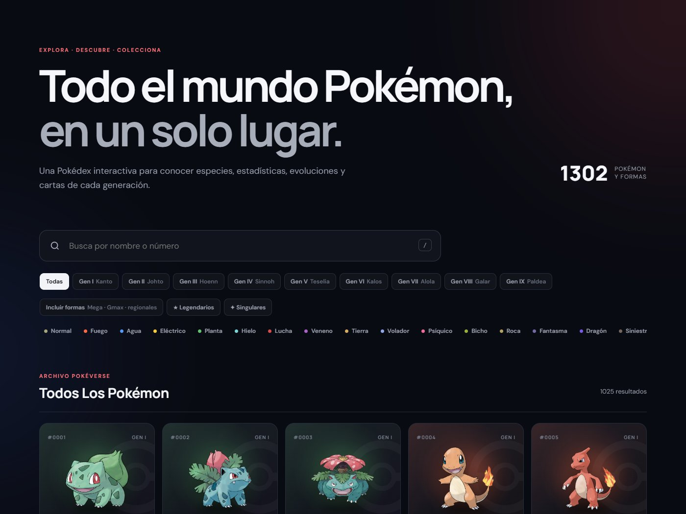
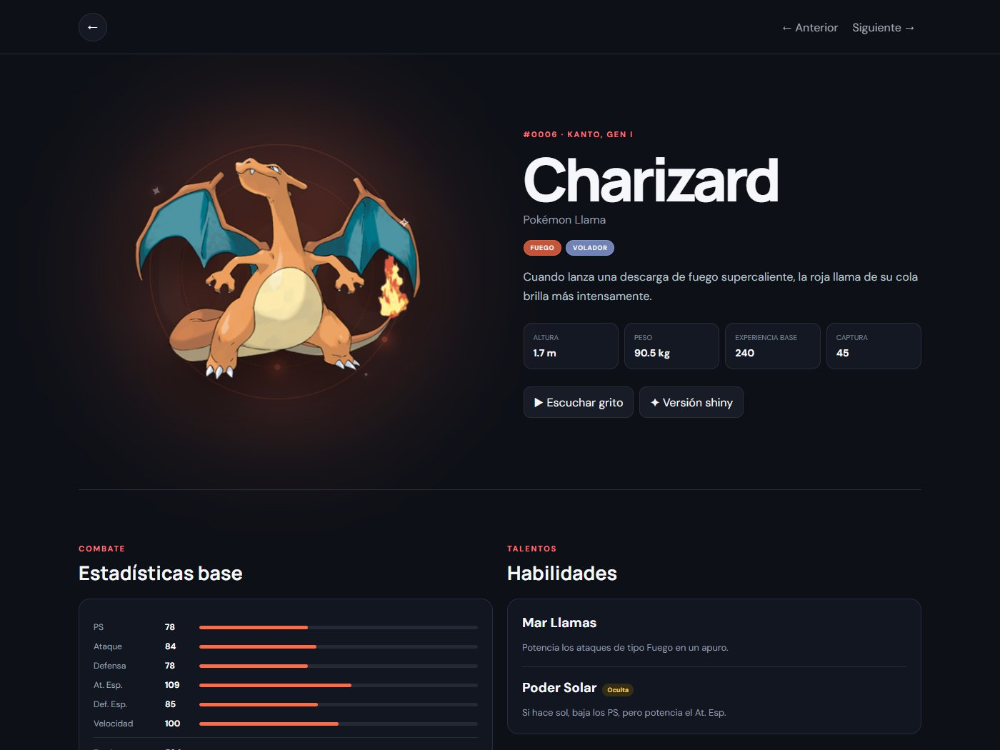
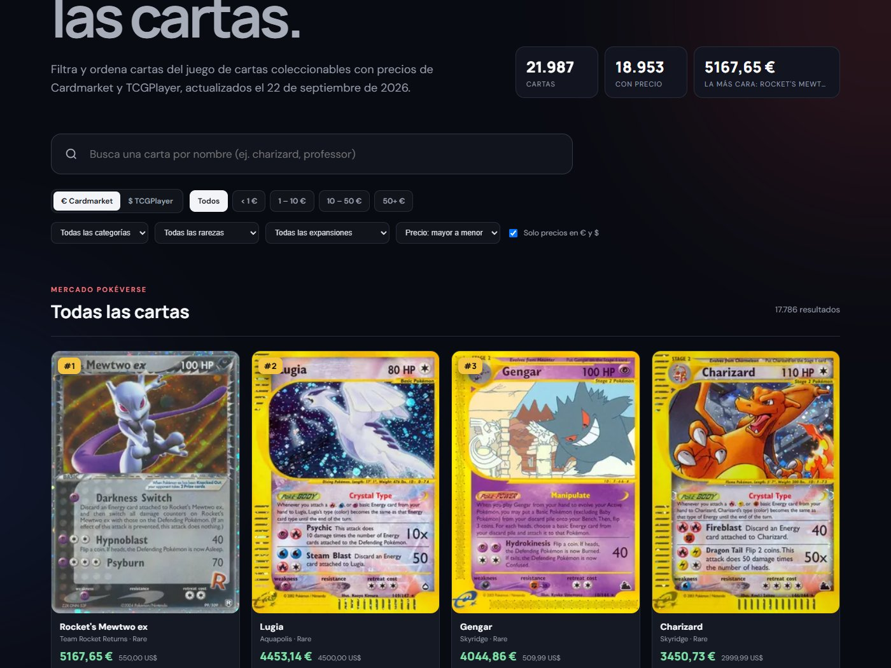

# PokéVerse

Pokédex web en español que muestra los 1302 Pokémon (1025 especies y sus formas Mega, Gmax y regionales) con su ficha completa y línea evolutiva. Incluye un mercado con los precios de unas 22.000 cartas del juego de cartas coleccionables (TCG).



## Funcionalidades

**Pokédex**
- Búsqueda por nombre o número con sugerencias. La tecla `/` enfoca el buscador.
- Filtros por generación (I–IX), por tipo, por formas especiales y por legendarios o singulares.
- Cuadrícula virtualizada: los 1302 Pokémon se recorren con fluidez porque solo se dibujan los visibles.

**Ficha de cada Pokémon** (`/pokemon/{nombre}`)
- Descripción, generación, región, altura, peso, grito y versión shiny.
- Estadísticas base, habilidades (con la oculta marcada) y debilidades y resistencias calculadas.
- Línea evolutiva en árbol, con ramas (Eevee, Wurmple, Ralts…) y la condición de cada evolución.
- Cartas TCG del Pokémon con precios de Cardmarket (€) y TCGPlayer ($), filtrables por rango, rareza y orden.
- Se navega entre Pokémon con las flechas ← →.



**Mercado** (`/mercado`)
- Todas las cartas con precio: búsqueda, moneda, rangos de precio, categoría, rareza y expansión.
- Ranking de las más caras. Por defecto solo muestra cartas con precio en ambos mercados, para evitar precios de ventas aisladas.
- Enlace directo de cada carta a la ficha de su Pokémon.



## Tecnologías

- [React 19](https://react.dev) + TypeScript (modo estricto) + [Vite](https://vite.dev)
- [TanStack Query](https://tanstack.com/query) para caché y estados de carga
- [TanStack Virtual](https://tanstack.com/virtual) para la cuadrícula virtualizada
- [Motion](https://motion.dev) para animaciones
- [React Router](https://reactrouter.com) para las rutas
- CSS propio, responsive y compatible con `prefers-reduced-motion`

## Empezar

Necesitas **Node.js 22.18 o superior**.

```bash
git clone https://github.com/elvicticor/Pokeverse.git
cd Pokeverse
npm install
npm run dev        # http://localhost:5173
```

| Comando | Qué hace |
|---|---|
| `npm run dev` | Servidor de desarrollo con recarga en caliente |
| `npm run build` | Comprueba los tipos y genera la versión de producción en `dist/` |
| `npm run preview` | Sirve el build de producción en local |
| `npm run cards` | Regenera `public/cards.json` con los precios de todas las cartas (unos 5–15 min) |

## Datos

No se necesita ninguna clave de API.

- **[PokéAPI](https://pokeapi.co)**: datos de los Pokémon. El índice completo se obtiene en una sola consulta a su API GraphQL y se guarda 24 h en el navegador.
- **[TCGdex](https://tcgdex.dev)**: cartas, imágenes y precios (Cardmarket y TCGPlayer).

TCGdex no permite filtrar por precio, así que el mercado usa `public/cards.json`, un archivo con todas las cartas y sus precios. Lo genera `scripts/build-cards.ts` y lo actualiza a diario el workflow [`.github/workflows/cards.yml`](.github/workflows/cards.yml) a las 06:00 UTC. También se puede lanzar a mano desde la pestaña **Actions**.

## Estructura

```text
src/
├── App.tsx              # rutas, portada y filtros de la Pokédex
├── api.ts               # acceso a PokéAPI y TCGdex
├── pricing.ts           # precio de referencia y formato de monedas
├── data.ts / types.ts   # constantes, traducciones y tipos
└── components/
    ├── PokemonGrid.tsx      # cuadrícula virtualizada
    ├── PokemonDetail.tsx    # ficha del Pokémon
    ├── Evolution.tsx        # árbol evolutivo
    ├── CardCollection.tsx   # cartas y visor con precios
    └── Market.tsx           # página /mercado
scripts/build-cards.ts   # genera public/cards.json
```

Las decisiones técnicas y los detalles de funcionamiento están documentados en [`CONTEXT.md`](CONTEXT.md).

## Despliegue

Es una SPA con rutas del lado del cliente (`/mercado`, `/pokemon/pikachu`). Para que esas rutas no den 404 al recargar la página, el hosting debe redirigir todas las rutas a `index.html`. En Vercel y Netlify basta con una regla de *SPA fallback*.

## Aviso legal

Proyecto sin ánimo de lucro, hecho para aprender. Pokémon y todos los nombres, imágenes y cartas relacionados son © Nintendo, Game Freak y The Pokémon Company. Este proyecto no está afiliado a ninguna de ellas. Los precios son orientativos y provienen de Cardmarket y TCGPlayer a través de TCGdex.
